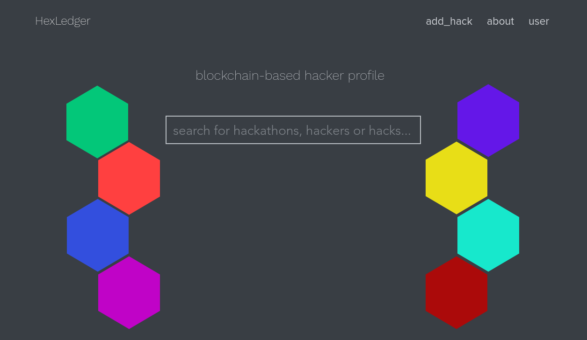

In fall 2018 our team was successful in applying to Hack Harvard, and travelled to Boston to take part. Besides being a great holiday this was also an interesting hack. The idea was inspired by one my teammates' unfortuante experience of having all of his 'I Demoed' stickers removed when he sent his laptop in for repair. We put the concept of the hexagonal MLH demo stickers onto a multichain blockchain, that a user could interface with via a frontend reminiscent of a social network for hackers. My contribution was the frontend, which I wrote in WixCode, in pursuit of Wix's prize (Macbook Pro's). In Boston I learned that graphic design is probably not the career for me, it was... not my finest work...

<section>
    
</section>

Our idea was a legitimate and novel use case for a blockchain (unlike the vast majority of things people seem to be trying to put on blockchains). Unfortunately, though the judges were impressed with the technicality of our hack, they didn't understand what we had made or why. Though this was disappointing, it had an amusing redeeming quality. The judges determined that ours was the "Most Useless Hack", and so out of 200 teams we joined 8 or so others in being official prizewinners. The code can be found <a href="https://gitlab.com/teambrewlabs/cryptohexes">here</a>. We consider this an absolute win.